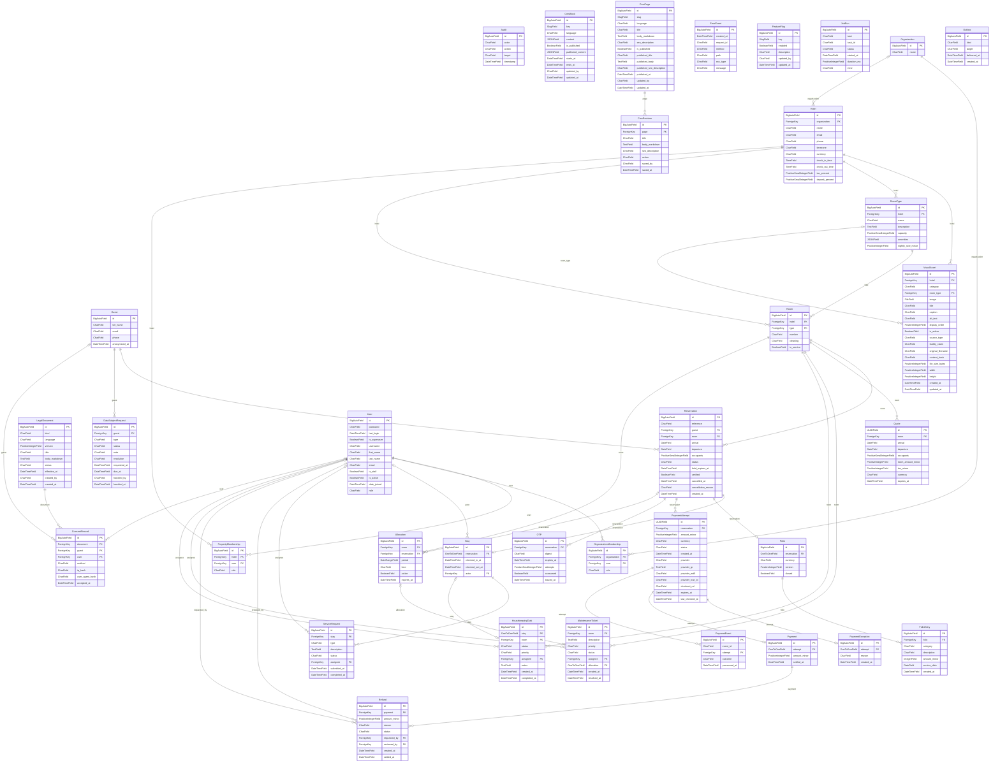

# Entity-relationship diagram

_Generated by `scripts/generate_docs.py` from `backend/core/models.py`. Do not edit by hand._

```mermaid
erDiagram
  Allocation {
    BigAutoField id PK
    ForeignKey room FK
    ForeignKey reservation FK
    DateRangeField period
    CharField kind
    BooleanField active
    DateTimeField expires_at
  }
  Audit {
    BigAutoField id PK
    CharField actor
    CharField action
    CharField target
    DateTimeField timestamp
  }
  CmsBlock {
    BigAutoField id PK
    SlugField key
    CharField language
    JSONField content
    BooleanField is_published
    JSONField published_content
    DateTimeField starts_at
    DateTimeField ends_at
    CharField updated_by
    DateTimeField updated_at
  }
  CmsPage {
    BigAutoField id PK
    SlugField slug
    CharField language
    CharField title
    TextField body_markdown
    CharField seo_description
    BooleanField is_published
    CharField published_title
    TextField published_body
    CharField published_seo_description
    DateTimeField published_at
    CharField updated_by
    DateTimeField updated_at
  }
  CmsRevision {
    BigAutoField id PK
    ForeignKey page FK
    CharField title
    TextField body_markdown
    CharField seo_description
    CharField action
    CharField saved_by
    DateTimeField saved_at
  }
  ConsentRecord {
    BigAutoField id PK
    ForeignKey document FK
    ForeignKey guest FK
    ForeignKey user FK
    CharField method
    CharField ip_hash
    CharField user_agent_hash
    DateTimeField accepted_at
  }
  DataSubjectRequest {
    BigAutoField id PK
    ForeignKey guest FK
    CharField type
    CharField status
    CharField note
    CharField resolution
    DateTimeField requested_at
    DateTimeField due_at
    CharField handled_by
    DateTimeField handled_at
  }
  ErrorEvent {
    BigAutoField id PK
    DateTimeField created_at
    CharField request_id
    CharField method
    CharField path
    CharField exc_type
    CharField message
  }
  FeatureFlag {
    BigAutoField id PK
    SlugField key
    BooleanField enabled
    CharField description
    CharField updated_by
    DateTimeField updated_at
  }
  Folio {
    BigAutoField id PK
    OneToOneField reservation FK
    CharField currency
    PositiveIntegerField version
    BooleanField closed
  }
  FolioEntry {
    BigAutoField id PK
    ForeignKey folio FK
    CharField category
    CharField description
    IntegerField amount_minor
    DateField service_date
    DateTimeField created_at
  }
  Guest {
    BigAutoField id PK
    CharField full_name
    CharField email
    CharField phone
    DateTimeField anonymized_at
  }
  Hotel {
    BigAutoField id PK
    ForeignKey organization FK
    CharField name
    CharField email
    CharField phone
    CharField timezone
    CharField currency
    TimeField check_in_time
    TimeField check_out_time
    PositiveSmallIntegerField tax_percent
    PositiveSmallIntegerField deposit_percent
  }
  HousekeepingTask {
    BigAutoField id PK
    OneToOneField stay FK
    ForeignKey room FK
    CharField status
    CharField priority
    ForeignKey assignee FK
    TextField notes
    DateTimeField created_at
    DateTimeField completed_at
  }
  JobRun {
    BigAutoField id PK
    CharField task
    CharField task_id
    CharField status
    DateTimeField started_at
    PositiveIntegerField duration_ms
    CharField error
  }
  LegalDocument {
    BigAutoField id PK
    CharField kind
    CharField language
    PositiveIntegerField version
    CharField title
    TextField body_markdown
    CharField status
    DateTimeField effective_at
    CharField created_by
    DateTimeField created_at
  }
  MaintenanceTicket {
    BigAutoField id PK
    ForeignKey room FK
    TextField description
    CharField priority
    CharField status
    ForeignKey assignee FK
    OneToOneField allocation FK
    DateTimeField created_at
    DateTimeField resolved_at
  }
  OTP {
    BigAutoField id PK
    ForeignKey reservation FK
    CharField digest
    DateTimeField expires_at
    PositiveSmallIntegerField attempts
    BooleanField consumed
    DateTimeField issued_at
  }
  Organization {
    BigAutoField id PK
    CharField name
  }
  OrganizationMembership {
    BigAutoField id PK
    ForeignKey organization FK
    ForeignKey user FK
    CharField role
  }
  Outbox {
    BigAutoField id PK
    CharField kind
    CharField target
    DateTimeField delivered_at
    DateTimeField created_at
  }
  Payment {
    BigAutoField id PK
    OneToOneField attempt FK
    PositiveIntegerField amount_minor
    DateTimeField settled_at
  }
  PaymentAttempt {
    UUIDField id PK
    ForeignKey reservation FK
    PositiveIntegerField amount_minor
    CharField currency
    CharField status
    DateTimeField created_at
    CharField provider
    TextField provider_qr
    CharField provider_md5
    CharField provider_tran_id
    CharField checkout_url
    DateTimeField expires_at
    DateTimeField last_checked_at
  }
  PaymentEvent {
    BigAutoField id PK
    CharField event_id
    ForeignKey attempt FK
    CharField outcome
    DateTimeField processed_at
  }
  PaymentException {
    BigAutoField id PK
    OneToOneField attempt FK
    CharField reason
    DateTimeField created_at
  }
  PropertyMembership {
    BigAutoField id PK
    ForeignKey hotel FK
    ForeignKey user FK
    CharField role
  }
  Quote {
    UUIDField id PK
    ForeignKey room FK
    DateField arrival
    DateField departure
    PositiveSmallIntegerField occupants
    PositiveIntegerField room_amount_minor
    PositiveIntegerField tax_minor
    CharField currency
    DateTimeField expires_at
  }
  Refund {
    BigAutoField id PK
    ForeignKey payment FK
    PositiveIntegerField amount_minor
    CharField reason
    CharField status
    ForeignKey requested_by FK
    ForeignKey reviewed_by FK
    DateTimeField created_at
    DateTimeField settled_at
  }
  Reservation {
    BigAutoField id PK
    CharField reference
    ForeignKey guest FK
    ForeignKey room FK
    DateField arrival
    DateField departure
    PositiveSmallIntegerField occupants
    CharField status
    DateTimeField hold_expires_at
    BooleanField verified
    DateTimeField cancelled_at
    CharField cancellation_reason
    DateTimeField created_at
  }
  Room {
    BigAutoField id PK
    ForeignKey hotel FK
    ForeignKey type FK
    CharField number
    CharField cleaning
    BooleanField in_service
  }
  RoomType {
    BigAutoField id PK
    ForeignKey hotel FK
    CharField name
    TextField description
    PositiveSmallIntegerField capacity
    JSONField amenities
    PositiveIntegerField nightly_rate_minor
  }
  ServiceRequest {
    BigAutoField id PK
    ForeignKey stay FK
    CharField type
    TextField description
    CharField status
    ForeignKey assignee FK
    DateTimeField submitted_at
    DateTimeField completed_at
  }
  Stay {
    BigAutoField id PK
    OneToOneField reservation FK
    DateTimeField checked_in_at
    DateTimeField checked_out_at
    ForeignKey actor FK
  }
  User {
    BigAutoField id PK
    CharField password
    DateTimeField last_login
    BooleanField is_superuser
    CharField username
    CharField first_name
    CharField last_name
    CharField email
    BooleanField is_staff
    BooleanField is_active
    DateTimeField date_joined
    CharField role
  }
  VisualAsset {
    BigAutoField id PK
    ForeignKey hotel FK
    CharField category
    ForeignKey room_type FK
    FileField image
    CharField title
    CharField caption
    CharField alt_text
    PositiveIntegerField display_order
    BooleanField is_active
    CharField source_type
    CharField facility_claim
    CharField original_filename
    CharField content_hash
    PositiveIntegerField file_size_bytes
    PositiveIntegerField width
    PositiveIntegerField height
    DateTimeField created_at
    DateTimeField updated_at
  }
  Allocation |o--o| MaintenanceTicket : "allocation"
  CmsPage ||--o{ CmsRevision : "page"
  Folio ||--o{ FolioEntry : "folio"
  Guest |o--o{ ConsentRecord : "guest"
  Guest ||--o{ DataSubjectRequest : "guest"
  Guest ||--o{ Reservation : "guest"
  Hotel ||--o{ PropertyMembership : "hotel"
  Hotel ||--o{ Room : "hotel"
  Hotel ||--o{ RoomType : "hotel"
  Hotel ||--o{ VisualAsset : "hotel"
  LegalDocument ||--o{ ConsentRecord : "document"
  Organization |o--o{ Hotel : "organization"
  Organization ||--o{ OrganizationMembership : "organization"
  Payment ||--o{ Refund : "payment"
  PaymentAttempt ||--o{ PaymentEvent : "attempt"
  PaymentAttempt ||--o| Payment : "attempt"
  PaymentAttempt ||--o| PaymentException : "attempt"
  Reservation |o--o{ Allocation : "reservation"
  Reservation ||--o{ OTP : "reservation"
  Reservation ||--o{ PaymentAttempt : "reservation"
  Reservation ||--o| Folio : "reservation"
  Reservation ||--o| Stay : "reservation"
  Room ||--o{ Allocation : "room"
  Room ||--o{ HousekeepingTask : "room"
  Room ||--o{ MaintenanceTicket : "room"
  Room ||--o{ Quote : "room"
  Room ||--o{ Reservation : "room"
  RoomType |o--o{ VisualAsset : "room_type"
  RoomType ||--o{ Room : "type"
  Stay |o--o| HousekeepingTask : "stay"
  Stay ||--o{ ServiceRequest : "stay"
  User |o--o{ ConsentRecord : "user"
  User |o--o{ HousekeepingTask : "assignee"
  User |o--o{ MaintenanceTicket : "assignee"
  User |o--o{ Refund : "requested_by"
  User |o--o{ Refund : "reviewed_by"
  User |o--o{ ServiceRequest : "assignee"
  User |o--o{ Stay : "actor"
  User ||--o{ OrganizationMembership : "user"
  User ||--o{ PropertyMembership : "user"
```
